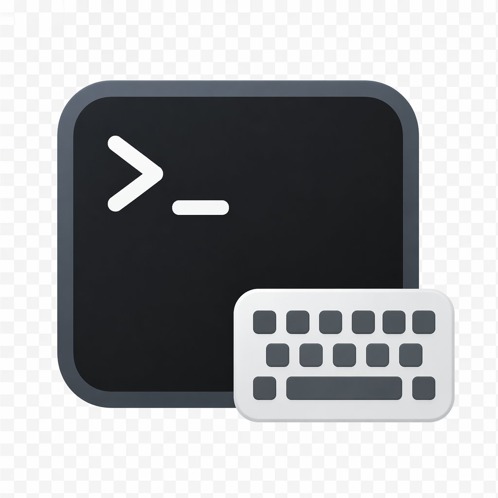

<h1 align="center">TermIMS</h1>

<p align="center"></p>

<p align="center">A lightweight macOS menu bar app that automatically switches input methods based on the focused app — and for terminals, by the running process or tab title.</p>

## Features

- **Per-app input method rules** — switch input methods when the focused app changes.
- **Terminal sub-rules** — match by process name or tab title for Ghostty, Apple Terminal, iTerm2, kitty, WezTerm, Warp. Patterns are case-insensitive substrings; wrap with `/.../` for regex.
- **Defaults** — global fallback plus a separate terminal default when no sub-rule matches.
- **Drag-and-drop ordering** — title rules run before process rules; within each type the first match wins.
- **Switch indicator** — brief on-screen overlay showing the new input method, with configurable position.

## How It Works

TermIMS uses the macOS Accessibility API to watch app focus and terminal tab changes. It picks the most precise channel each terminal exposes — AppleScript for Apple Terminal and iTerm2, the bundled CLI for kitty and WezTerm, AX cwd for Ghostty — and falls back to a process-tree + working-directory heuristic otherwise.

## Terminal Support

Different terminals expose different signals about the focused tab. Status as of current testing:

| Terminal | Channel | Status | Extra setup |
|---|---|---|---|
| Ghostty | `AXDocument` cwd + process-tree heuristic | Works for tabs in distinct working directories; multiple tabs sharing a cwd need a title rule to disambiguate | None |
| Apple Terminal | AppleScript `tty of selected tab` | Works precisely for every tab | First launch macOS prompts for **Automation → Terminal** — accept it |
| kitty | `kitten @ ls` JSON | Works precisely for every tab | Add `allow_remote_control yes` **and** `listen_on unix:/tmp/kitty` to `~/.config/kitty/kitty.conf` and restart kitty. The socket path can be anything — TermIMS reads `listen_on` from the same file. |
| WezTerm | `wezterm cli list` JSON | Works precisely for every tab | None |
| iTerm2 | AppleScript `tty of current session of current window` | Works precisely for every tab and split pane | First launch macOS prompts for **Automation → iTerm**; accept it |
| Warp | Process-tree heuristic | Best-effort. Warp doesn't expose tabs to AX ([#11160](https://github.com/warpdotdev/warp/issues/11160)) and ships no AppleScript ([#3364](https://github.com/warpdotdev/warp/issues/3364)) or query CLI, so when multiple tabs share a cwd disambiguation is brittle. | None |
| Alacritty | Not supported | No AX cwd, no query CLI, title doesn't track the running command. Use tmux inside a single window. | n/a |

On the generic-heuristic path, each tab in its own working directory works out of the box. When tabs share a directory the matcher can't tell them apart from cwd alone — add a **Tab Title** rule to disambiguate.

### tmux (and other multiplexers)

tmux runs every pane on its own pty under the `tmux` server, which macOS can't see into — the terminal's tty foreground process is always `tmux`, so Process Name rules for commands inside tmux won't match. Push the active pane's command into the title and use a **Tab Title** rule instead:

```tmux
set -g set-titles on
set -g set-titles-string "#{pane_current_command}"
```

## Requirements

- macOS 13.0+
- Accessibility permission (System Settings → Privacy & Security → Accessibility)
- Automation permission for Apple Terminal and/or iTerm2 if you use them (System Settings → Privacy & Security → Automation → TermIMS → ...). macOS prompts on first focus event for each app — just accept.

## Install

### Download

Download `TermIMS.dmg` from the [Releases](https://github.com/cuiko/TermIMS/releases) page, open it, and drag `TermIMS.app` into the `Applications` folder.

### Build from source

Swift Package Manager layout, no Xcode project. `make` wraps `swift build -c release` and bundles the binary into `TermIMS.app` via `Scripts/package-app.sh`.

```sh
git clone https://github.com/cuiko/TermIMS.git
cd TermIMS

make build      # build into build/TermIMS.app
make install    # build + copy to /Applications
make run        # build + install + launch
make dist       # package dist/TermIMS.dmg
```

Requires Swift 5.9+ (Xcode 15).

## Usage

1. Launch TermIMS (or run `make run`).
2. Grant Accessibility permission when prompted.
3. Click the keyboard icon in the menu bar → **Settings**.
4. **General** tab — Set the global default input method, indicator preferences, and optional debug logging.
5. **App Rules** tab — Click **+** to add an app and assign its input method. Drag rows to reorder.
6. **Terminal Rules** tab — Set the terminal default, then add rules to match by process name or tab title. Drag to reorder; title rules are checked before process rules.

### Terminal Rules Example

| Match        | Pattern         | Input Method | Note                              |
|--------------|-----------------|--------------|-----------------------------------|
| Tab Title    | `/^[⠁-⣿✳] /`    | Pinyin       | Claude Code spinner / idle prefix |
| Tab Title    | `ssh`           | ABC          | Remote sessions                   |
| Process Name | `nvim`          | ABC          |                                   |

Patterns are case-insensitive substrings by default. Wrap with slashes (`/pattern/`, append `i` for case-insensitive) to use a regex.

#### Why the Claude rule uses a title regex

`Process Name = claude` mis-fires when several Ghostty/Warp tabs share a working directory — TermIMS can't pin focus to one tty from cwd alone, so a sibling tab running `claude` triggers the rule on the focused (non-Claude) tab. Claude Code rewrites the terminal title to `⠂ <summary>` while thinking (Braille spinner, U+2801–U+28FF) and `✳ <summary>` when idle; `/^[⠁-⣿✳] /` catches both forms and only matches a focused Claude tab. The same trick works for any tool with a distinctive title prefix.

#### Process names vs. user-typed commands

Process Name rules match the kernel-reported executable (`kp_proc.p_comm`), not the typed command. Many wrappers (`mole`, `cargo`, `bundle`, `mise`, `asdf`, …) `exec` into a different binary, so `mole analyze` shows up as `analyze-go`. Match the underlying binary, or use a Tab Title rule (shell `preexec` hooks usually put the typed command in the title).

## Uninstall

Trashing `TermIMS.app` only removes the bundle. Run the bundled uninstall script to also quit the app, unload the launch agent, and delete the UserDefaults plist, log directory, and caches:

```sh
curl -fsSL https://raw.githubusercontent.com/cuiko/TermIMS/main/uninstall.sh | bash
```

macOS doesn't let scripts revoke privacy grants — remove TermIMS from **System Settings → Privacy & Security → Accessibility** (and **→ Automation** if you used Apple Terminal / iTerm2) by hand.

---

Inspired by [KeyboardHolder](https://github.com/leaves615/KeyboardHolder).

## License

[MIT](LICENSE)
